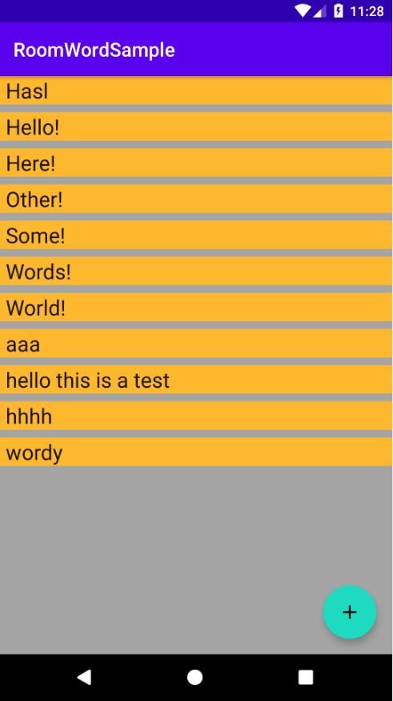
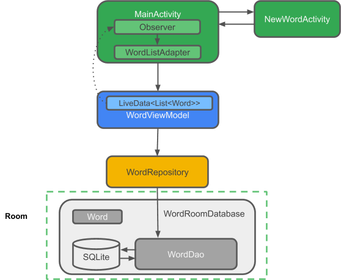

# RoomWordSample

This tutorial is from: https://codelabs.developers.google.com/codelabs/android-room-with-a-view-kotlin

The goal is to learn the simplest posible project of the whole lifecycle of an entity, from creation to reading it from the database.

## Application

## Summary

App structure:

The components of the app are:

* MainActivity: displays words in a list using a RecyclerView and the WordListAdapter. In MainActivity, there is an Observer that observes the words LiveData from the database and is notified when they change.
NewWordActivity: adds a new word to the list.
WordViewModel: provides methods for accessing the data layer, and it returns LiveData so that MainActivity can set up the observer relationship.
* LiveData<List<Word>>: Makes possible the automatic updates in the UI components. In the MainActivity, there is an Observer that observes the words LiveData from the database and is notified when they change.
* Repository: manages one or more data sources. The Repository exposes methods for the ViewModel to interact with the underlying data provider. In this app, that backend is a Room database.
* Room: is a wrapper around and implements a SQLite database. Room does a lot of work for you that you used to have to do yourself.
* DAO: maps method calls to database queries, so that when the Repository calls a method such as getAlphabetizedWords(), Room can execute SELECT * from word\_table ORDER BY word ASC.
* Word: is the entity class that contains a single word.

### Flow of Data for Automatic UI Updates (Reactive UI)
The automatic update is possible because we are using LiveData. In the MainActivity, there is an Observer that observes the words LiveData from the database and is notified when they change. When there is a change, the observer's onChange() method is executed and updates mWords in the WordListAdapter.

* The data can be observed because it is LiveData. And what is observed is the LiveData<List<Word>> that is returned by the WordViewModel allWords property.

* The WordViewModel hides everything about the backend from the UI layer. It provides methods for accessing the data layer, and it returns LiveData so that MainActivity can set up the observer relationship. Views and Activities (and Fragments) only interact with the data through the ViewModel. As such, it doesn't matter where the data comes from.

In this case, the data comes from a Repository. The ViewModel does not need to know what that Repository interacts with. It just needs to know how to interact with the Repository, which is through the methods exposed by the Repository.

The Repository manages one or more data sources. In the WordListSample app, that backend is a Room database. Room is a wrapper around and implements a SQLite database. Room does a lot of work for you that you used to have to do yourself. For example, Room does everything that you used to do with an SQLiteOpenHelper class.

The DAO maps method calls to database queries, so that when the Repository calls a method such as getAllWords(), Room can execute SELECT * from word_table ORDER BY word ASC.

Because the result returned from the query is observed LiveData, every time the data in Room changes, the Observer interface's onChanged() method is executed and the UI updated.
